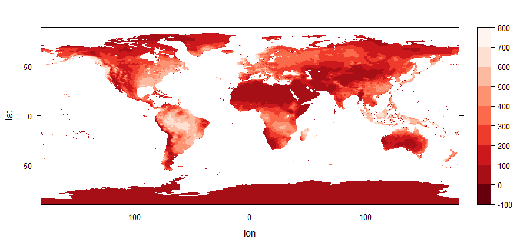
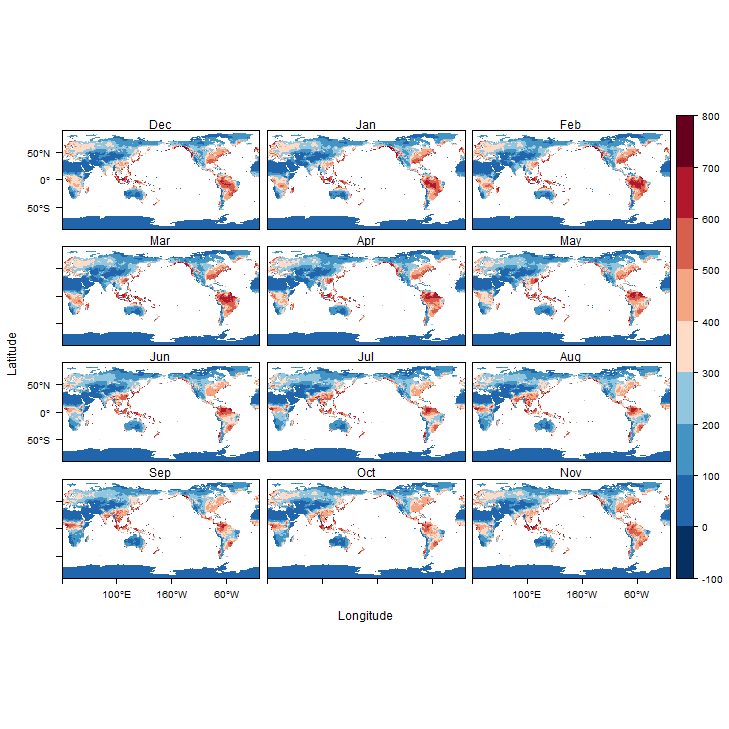
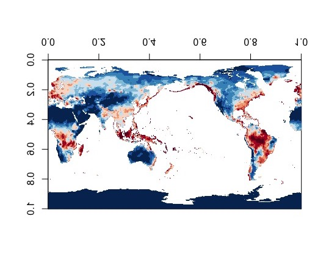
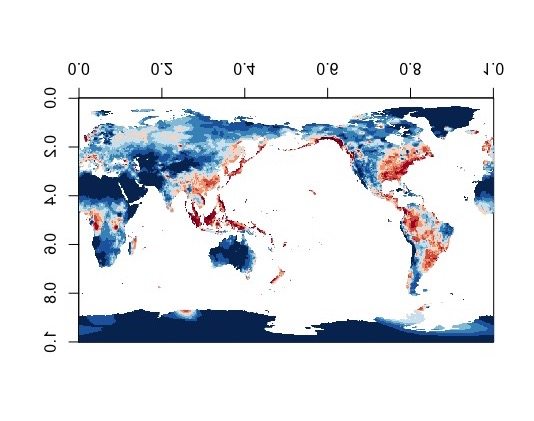

##Soil Moister - Final Project
Geoffrey Campbell  
GEOG 490  
Patrick Bartlein  
6/13/2019  

The data contains information about global soil moisture from 1948/01 to 2019/05  
The Data comes from the ESRL website.  [Link to data](https://www.esrl.noaa.gov/psd/data/gridded/data.cpcsoil.html)

1. This project aims to... 
	1. Map the global soil moisture around the world.
	2. Show any changes of global soil moisture over the past 72 years.
	3. Display the monthly variations of global soil moisture.

###Load the required packages  

	library(sf) 
	library(ncdf4)
	library(raster)
	library(rasterVis)
	library(RColorBrewer)
	library(ncdf.tools)
	library(ggplot2)
	library(ggthemes)
	library(zoo)  

###Load the netCDF data

	shp_path <- "C:/Users/Geoffrey/Documents/Rdata/"
	shp_name <- "ne_110m_admin_0_countries.shp"
	shp_file <- paste(shp_path, shp_name, sep="")

	ncpath <- "C:/Users/Geoffrey/Documents/Rdata/"
	ncname <- "soilw.mon.ltm.v2.nc"  
	ncfname <- paste(ncpath, ncname, sep="")
	soil <- raster(ncfname, varname="soilw")

###This code creates a soil moisture map of the world.

	ncin <- nc_open(ncfname)
	print(ncin)

	lon <- ncvar_get(ncin,"lon")
	nlon <- dim(lon)
	head(lon)
	
	lat <- ncvar_get(ncin,"lat")
	nlat <- dim(lat)
	head(lat)

	time <- ncvar_get(ncin,"time")
	tunits <- ncatt_get(ncin,"time","units")
	nt <- dim(time)
	print (c(nlon, nlat, nt))

	tustr <- strsplit(tunits$value, " ")
	ptime <- convertDateNcdf2R(time, unlist(tustr)[1], 
                           origin = as.POSIXct(unlist(tustr)[3],                                                	tz = "UTC"), time.format = "%Y-%m-%d")
	head(time); tail(time)

	head(ptime); tail(ptime)

	soil_mon <- ncvar_get(ncin,dname_mon)
	dlname_mon <- ncatt_get(ncin,dname_mon,"long_name")
	dunits_mon <- ncatt_get(ncin,dname_mon,"units")
	fillvalue_mon <- ncatt_get(ncin,dname_mon,"_FillValue")
	dim(soil_mon)

	nc_close(ncin)

	temp_lat <- rep(NA, nlat)
	temp_lat[1:nlat] <- lat[nlat:1]
	temp_lat

	lat <- temp_lat

	temp_array <- array(NA, dim = c(nlon, nlat, nt))
	temp_array[1:nlon, 1:nlat, 1:nt] <-  soil_mon[1:nlon, nlat:1, 1:nt] 
	soil_mon <- temp_array

	temp_lon <- rep(NA, nlon)
	temp_lon[1:(nlon/2)] <-  lon[((nlon/2)+1):nlon] - 360.0
	temp_lon[((nlon/2)+1):nlon] <-  lon[1:(nlon/2)]
	temp_lon
	lon <- temp_lon

	temp_array <- array(NA, dim = c(nlon, nlat, nt))
	temp_array[1:(nlon/2), 1:nlat, 1:nt] <-  soil_mon[((nlon/2)+1):nlon, 	nlat:1, 1:nt] 
	temp_array[((nlon/2)+1):nlon, 1:nlat, 1:nt] <-  soil_mon[1:(nlon/2), nlat:1, 1:nt]
	soil_mon <- temp_array

	n <- 2
	grid <- expand.grid(lon=lon, lat=lat)
	levelplot(soil_mon[,, n] ~ lon * lat, data=grid, cuts=11, pretty=T, 
          col.regions=(rev(brewer.pal(10,"Reds"))))

###Result   
###1981 Janurary (Red to White: Low Moisture to High Moisture)

###When looking at this map. Soil moisture values seems to be high when it's in an area where it does not lack precipitation values such as the Amazon and East Asia and low when it's in an area with low precipitation values such as the Arctic and Persian Gulf.

###This is the code to produce a plot that shows the monthly soil variations

	monthly <- stack(ncfname)
	names(monthly) <- c("Dec","Jan","Feb","Mar","Apr","May","Jun","Jul","Aug","Sep","Oct","Nov")

	pngfile <- "months.png"
	png(pngfile, width=729, height=729)
	levelplot(monthly , cuts=11, pretty=T, 
                col.regions=(rev(brewer.pal(10,"RdBu"))))

###Result  
###1981 Janurary (Blue to Red: Low Moisture to High Moisture)

###Upon closer inspection.  We can see multiple regions soil moisture rates have a noticeable change throughout the year such as Northern Europe, India, Sub-Saharan Africa, and South America. Regions that don't have any noticeable changes can also be seen on the map such as the Urals, Persian Gulf, and Australia. This can be partly explained by the regions varied precipitation rates. Regions that don't have low precipitation rates and have a wet and dry season can be seen on the map. While regions that have very low or no precipitation rates can be seen maintain a single color monthly. 

###This is the code that compares Janurary 1948 to Janurary 2019

	ncin <- nc_open(ncfname)
	lon <- ncvar_get(ncin,"lon")
	nlon <- dim(lon)
	lat <- ncvar_get(ncin,"lat")
	nlat <- dim(lat)

	time <- ncvar_get(ncin,"time")
	tunits <- ncatt_get(ncin,"time","units")
	nt <- dim(time)

	soil_array <- ncvar_get(ncin,dname)
	dlname <- ncatt_get(ncin,dname,"long_name")
	dunits <- ncatt_get(ncin,dname,"units")
	fillvalue <- ncatt_get(ncin,dname,"_FillValue")

	m <- 1
	soil_slice <- soil_array[,,m]

	image(soil_slice, col=rev(brewer.pal(10,"RdBu")))

	m <- 852
	soil_slice <- soil_array[,,m]

	image(soil_slice, col=rev(brewer.pal(10,"RdBu")))
	
###Result

###1948 Janurary (Blue to Red: Low Moisture to High Moisture)

###2019 Janurary (Blue to Red: Low Moisture to High Moisture)

###After the 72 year difference, several things can be noticed that can be attributed to phenomenons today. The soil moisture in the Amazon Rain Forest and Sub Saharan Africa has significantly grown weaker over the past 72 years. This can be possibly attribted to anthropogenic actitivities such as urbanization and logging leaving less capicity for soil moisture. In contrast, an increase in soil moisture can be seen in the North East of the United States. This can be possibly explained by the reforestation trend that has been occuring over the past 100 years in that region when agriculture was replaced by urbanization leaving areas to be naturally reforested.
