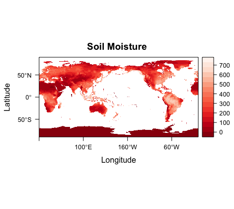

     3 variables (excluding dimension variables):
        double climatology_bounds[nbnds,time]   
            long_name: Climate Time Boundaries
            units: days since 1948-1-1 0:0:0
        float soilw[lon,lat,time]   
            long_name: Model-Calculated Long Term Monthly Mean Soil Moisture
            missing_value: -9.96920996838687e+36
            units: mm
            dataset: CPC Monthly Soil Moisture
            var_desc: Soil Moisture
            level_desc: Surface
            statistic: Long Term Mean
            parent_stat: Other
            standard_name: lwe_thickness_of_soil_moisture_content
            cell_methods: time: mean (monthly from values)
            scale_factor: 1
            add_offset: 0
            valid_range: 0
             valid_range: 1000
            actual_range: 1.86264514923096e-06
             actual_range: 743.505004882812
        float valid_yr_count[lon,lat,time]   
            long_name: count of non-missing values used in mean
            missing_value: 32767
            add_offset: 0
            scale_factor: 1

     4 dimensions:
        lon  Size:720
            long_name: Longitude
            units: degrees_east
            actual_range: 0.25
             actual_range: 359.75
            standard_name: longitude
            axis: X
            coordinate_defines: point
        lat  Size:360
            long_name: Latitude
            units: degrees_north
            actual_range: 89.75
             actual_range: -89.75
            standard_name: latitude
            axis: Y
            coordinate_defines: point
        time  Size:12
            long_name: Time
            delta_t: 0000-01-00 00:00:00
            avg_period: 0000-01-00 00:00:00
            standard_name: time
            axis: T
            coordinate_defines: start
            prev_avg_period: 0000-00-01 00:00:00
            climatology: climatology_bounds
            climo_period: 1981/01/01 - 2010/12/31
            interpreted_actual_range: 0001/01/01 00:00:00 - 0001/12/01 00:00:00
            units: days since 1800-01-01 00:00:0.0
            actual_range: -657073
             actual_range: -656739
        nbnds  Size:2

    7 global attributes:
        Conventions: CF-1.0
        history: Created 2011/08/31 by doMonthLTM
        title: CPC Soil Moisture
        institution: NOAA/ESRL PSD
        not_missing_threshold_percent: minimum 3% values input to have non-missing output value
        dataset_title: CPC Soil Moisture
        References: https://www.esrl.noaa.gov/psd/data/gridded/data.cpcsoil.html